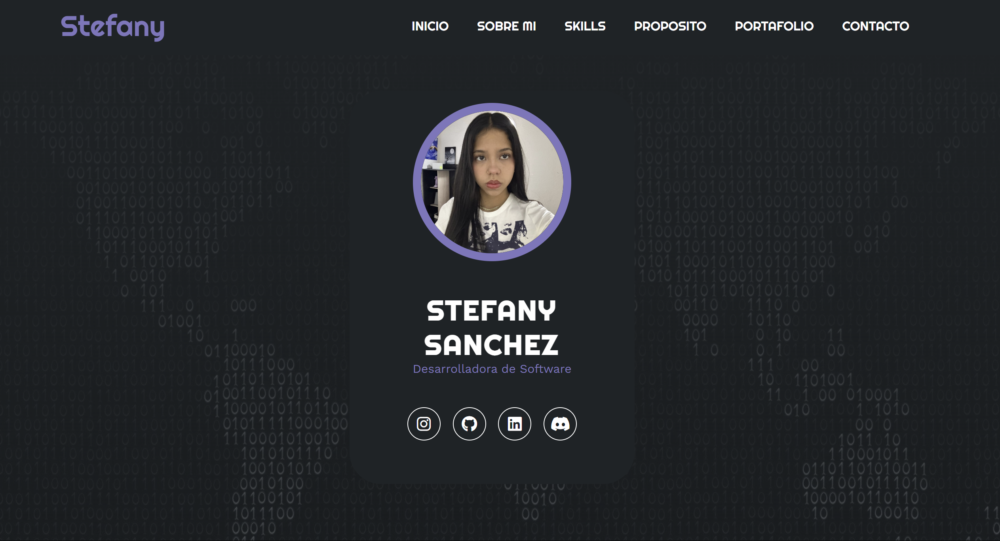

# Portafolio Stefany
Este portafolio personal fue desarrollado para mostrar mi trabajo como Desarrolladora de Software. Está diseñado para ser una representación dinámica de mis habilidades y proyectos, utilizando tecnologías web como HTML y CSS. A través de este sitio, los visitantes pueden explorar mis habilidades técnicas, mis proyectos más relevantes, y conocer un poco más sobre mí. Cada sección está estructurada para proporcionar una visión clara de mi enfoque en el desarrollo de soluciones tecnológicas creativas y colaborativas. Además, incluye enlaces a mis perfiles profesionales y una forma de contacto directa.



## Tabla de contenido

| Index | Titulo |
| ------ | --------------- |
| 1. | Descripcion del Proyecto |
| 2. | Requrimientos del sistema |
| 3. | Instalaciom |
| 4. | Video|
| 5. | FAQs|
| 6. | Licencia |
| 7. | Contacto |

# Requisitos del Sistema

Listado de tecnologías utilizadas en el proyecto:

- **HTML**: Lenguaje de marcado utilizado para estructurar y crear el contenido del sitio web. Es la base para cualquier página web y se utiliza para definir la estructura de las secciones y elementos.

- **CSS**: Lenguaje de estilo utilizado para dar formato y diseñar el aspecto visual del sitio web. Con CSS se controla el diseño, los colores, las fuentes y la disposición de los elementos en la página.

## Instalacion

Clone the project

```bash
  git clone https://github.com/Stefanyyy15/PortafolioStefany.git
```

Go to the project directory

```bash
  cd PortafolioStefany
```

Go to file

```bash
  code .
```
## Video

- **Link**: [https://drive.google.com/file/d/1M7TAWPz0Rqyf3JyBhOFwBp5hzQ_FpMwL/view?usp=sharing](https://drive.google.com/file/d/1M7TAWPz0Rqyf3JyBhOFwBp5hzQ_FpMwL/view?usp=sharing)

## FAQs
Lista de preguntas frecuentes:
1. ¿Cómo puedo contribuir al proyecto?
   _Puedes contribuir creando un fork del repositorio y enviando un pull request._

2. ¿Dónde puedo encontrar más información sobre Olivia Rodrigo?
   Puedes visitar su [página oficial]([https://store.oliviarodrigo.com/pages/gutsworldtour](https://store.oliviarodrigo.com/pages/gutsworldtour)) o seguirla en sus redes sociales.

3. ¿Este proyecto está abierto a contribuciones?
   | Tipo de contribución | Aceptado | Comentarios |
   |:---------------------|:--------:|------------:|
   | Reporte de errores   | Sí       | Utiliza la sección de issues en GitHub |
   | Nuevas características| Sí      | Envía un pull request con tus propuestas |

## Licencia

Este proyecto está licenciado bajo la Licencia MIT. 

[](https://choosealicense.com/licenses/mit/)

## Contacto

Si tienes alguna pregunta o deseas más información, no dudes en contactarme:

- **Nombre**: Stefany
- **GitHub**: [https://github.com/Stefanyyy15](https://github.com/Stefanyyy15)

---
